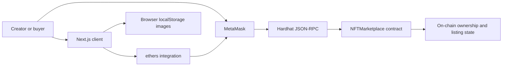

# Artefact NFT Marketplace V2

[](https://github.com/ChristianUgo/artefact-NFTs-Marketplace-V2/actions/workflows/ci.yml)

Artefact is a local-first NFT marketplace that demonstrates an end-to-end ERC-721 sale on a Hardhat network. A creator can mint and list an NFT, a second MetaMask account can purchase it, and the buyer can verify on-chain ownership in Portfolio.

This repository is intentionally scoped as an auditable portfolio project. It proves the core marketplace lifecycle without presenting local browser storage or a development chain as production infrastructure.

## Demonstrated flow

1. Connect MetaMask to Hardhat chain `31337`.
2. Mint an ERC-721 with metadata and pay the marketplace listing fee.
3. Escrow the token in the marketplace contract.
4. Switch to a different Hardhat account.
5. Purchase the listing for its exact asking price.
6. Transfer payment to the seller and ownership to the buyer.
7. Remove the sold token from active listings and show it in the buyer's Portfolio.

## Technology

| Layer | Technology | Responsibility |
| --- | --- | --- |
| Frontend | Next.js 16, React 19 | Marketplace, minting, purchase, and Portfolio views |
| Wallet integration | MetaMask, ethers 6 | Account access, chain validation, reads, and signed transactions |
| Smart contract | Solidity 0.8.4, OpenZeppelin ERC721URIStorage | Minting, escrow, listings, sales, ownership, and token metadata |
| Development chain | Hardhat 2 | Deterministic local accounts, deployment, and contract testing |
| Styling | CSS, Tailwind PostCSS pipeline | Responsive application interface |
| Quality gates | Mocha, Node strict assertions, GitHub Actions | Contract lifecycle tests and production-build verification |

## Architecture



The contract is the source of truth for token ownership, listing price, seller, sale status, and active listings. The browser stores only the uploaded test image. Metadata contains a browser-local lookup key, which is suitable for a single-machine demonstration but not durable NFT storage.

## Local setup

Requirements:

- Node.js 20 or later
- MetaMask
- Git

Install dependencies:

```powershell
npm ci
```

Open three PowerShell terminals in the project directory. In each terminal, isolate Hardhat's local settings:

```powershell
$env:APPDATA = "$PWD\.appdata"
```

Start the local blockchain in terminal 1:

```powershell
npm run node
```

Deploy the marketplace in terminal 2:

```powershell
npm run deploy:local
```

Start the application in terminal 3:

```powershell
npm run dev -- -p 3005
```

Open [http://localhost:3005](http://localhost:3005). Configure MetaMask with RPC URL `http://127.0.0.1:8545` and chain ID `31337`, then import two test accounts printed by Hardhat. Never use a real wallet seed phrase or real funds with this project.

## Verification

```powershell
npm run test:contracts
npm run lint
npm run build
```

The contract suite is deliberately concise and tests behavior rather than implementation details:

- minting and marketplace escrow;
- exact listing data and asking price;
- seller payment and buyer ownership transfer;
- removal of sold NFTs from active listings;
- buyer Portfolio ownership data;
- rejection of an underpaid purchase.

## Design decisions and trade-offs

| Decision | Benefit | Trade-off |
| --- | --- | --- |
| Contract escrow | A listed token cannot be transferred away before purchase | Adds a custody step and extra storage writes |
| Exact-price purchase | Predictable settlement with no refund branch | The buyer must submit the exact current price |
| On-chain token URI | Self-contained metadata reference for the demo | `ERC721URIStorage` costs more gas than a base-URI design |
| Browser-local images | No API key, pinning service, or upload backend is required | Images do not follow the NFT to another browser or computer |
| Array-returning read methods | Simple frontend integration for a small demonstration | Linear scans do not scale to large collections |
| Local Hardhat network | Fast, deterministic testing with disposable accounts | Restarting the node clears state and changes deployment context |

## Gas considerations

The contract prioritizes readability and tutorial traceability over minimum gas usage.

- `ERC721URIStorage` writes token-specific URI data to storage. A production collection can reduce minting cost with a shared base URI, content-addressed metadata, or event-indexed metadata.
- Marketplace listings store a complete `MarketItem` struct. Struct packing, custom errors, and narrower data types could reduce deployment and transaction gas after measuring real usage.
- `fetchMarketItems`, `fetchMyNFTs`, and `fetchItemsListed` scan all minted token IDs. These are intended as off-chain RPC reads for a small demo; production discovery should use indexed events and an indexer.
- OpenZeppelin `Counters` favors clarity. A reviewed production implementation could use an unchecked increment where overflow is provably unreachable.

No gas-optimization claim is made without benchmarks. Correct ownership and settlement behavior take priority in this version.

## Security assumptions

This contract has not been professionally audited and must not hold real assets.

- The deployment owner is trusted to change the listing fee.
- Users are expected to interact through the supplied interface on chain `31337`.
- Payments use Solidity `transfer`, which limits forwarded gas but can reject contract-wallet recipients. A production version should use a pull-payment design or checked `call` with reentrancy protection.
- The interface prevents a seller from buying their own listing, but production invariants should also be enforced in the contract.
- Contract state is authoritative; browser notices are shown only after transaction confirmation.
- Uploaded media is untrusted browser input and is limited to image MIME types and 2 MB by the interface.

See [SECURITY.md](SECURITY.md) for disclosure guidance and the complete non-production warning.

## Project structure

```text
contracts/NFTMarketplace.sol   ERC-721 marketplace contract
scripts/deploy.js              Local deployment and frontend address update
test/NFTMarketplace.js         Focused mint and purchase lifecycle tests
src/lib/marketplace.js         ethers, MetaMask, metadata, and contract adapter
src/app/page.js                Marketplace, create, purchase, and Portfolio UI
src/app/globals.css            Responsive visual system
.github/workflows/ci.yml       Pull-request quality gates
```

## Roadmap to production

- Move images and metadata to IPFS or another durable content-addressed store.
- Add indexed-event ingestion instead of full-collection scans.
- Replace push payments with a withdrawal pattern.
- Add contract-level seller/buyer invariants and reentrancy protection.
- Upgrade Solidity and OpenZeppelin after a dedicated migration review.
- Add testnet configuration, deployment verification, gas reporting, and an external audit.
